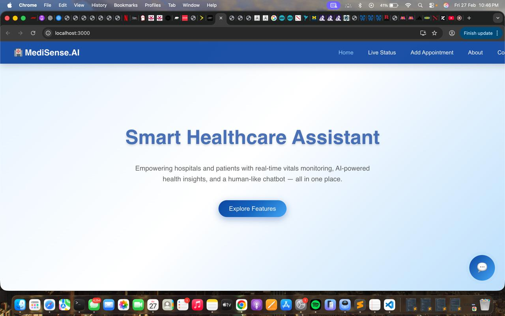
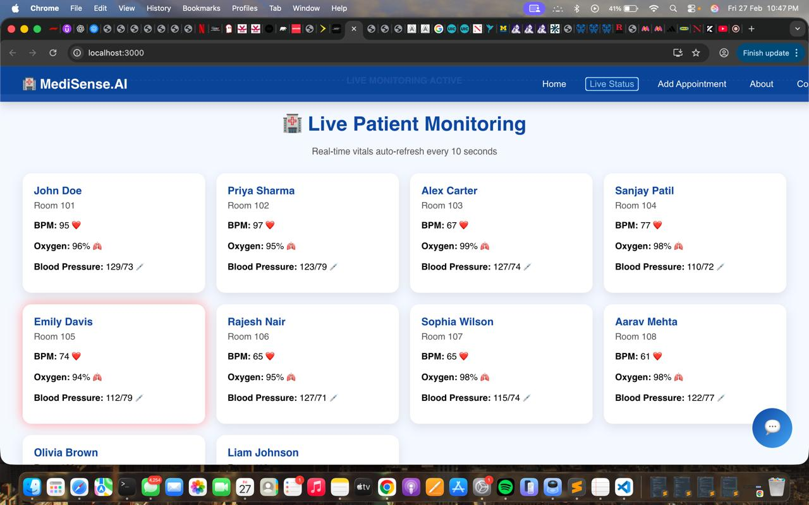
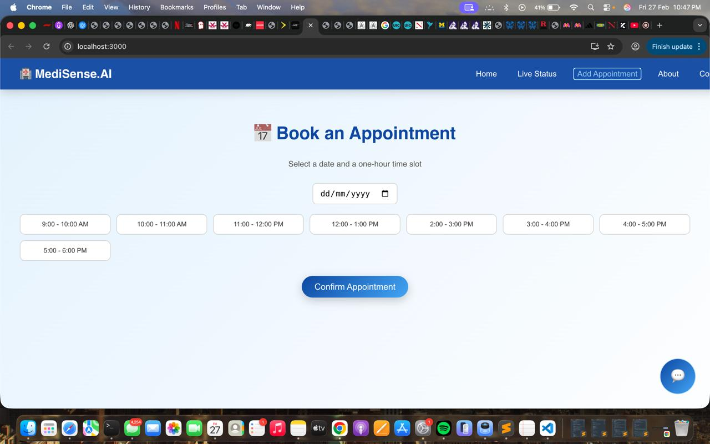
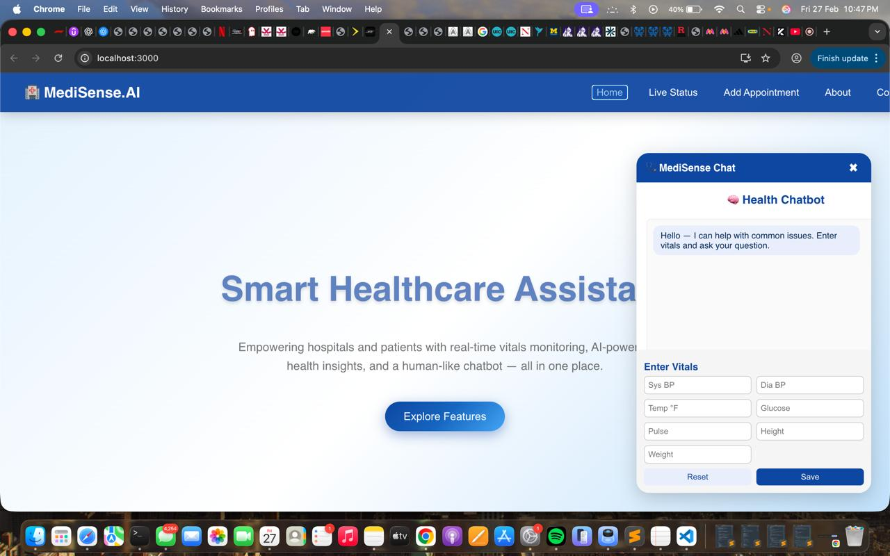

🏥 SmartCare HMS – MediSense.AI
Full-Stack Healthcare Management & Monitoring System

Built with React · Java · Spring Boot · MySQL

📌 Overview

SmartCare HMS (MediSense.AI) is a full-stack healthcare web application designed to assist hospitals in managing patients, monitoring live vitals, booking appointments, and interacting through a health chatbot interface.

The system demonstrates:

Real-time dashboard rendering

REST API integration

Relational database management

Clean component-based frontend architecture

🚀 Key Features
🏠 Smart Landing Page

Modern and responsive UI

Centralized navigation to all modules

Clean healthcare-focused design

📊 Live Patient Monitoring Dashboard

Real-time vitals display

Auto-refresh mechanism

Patient card-based UI layout

Vitals Monitored:

❤️ Heart Rate (BPM)

🫁 Oxygen Levels

🩺 Blood Pressure

📅 Appointment Booking System

Date-based scheduling

Time-slot selection interface

Confirmation workflow

Backend-integrated storage

💬 Health Chatbot Interface

Embedded interactive chatbot

Accepts patient vitals input

Simulated AI-style interaction

Clean, user-friendly design

🛠 Tech Stack
🔹 Frontend

React

JavaScript (ES6+)

HTML5

CSS3

🔹 Backend

Java

Spring Boot

Spring Data JPA

Hibernate ORM

RESTful API Architecture

🔹 Database

MySQL

🏗 System Architecture
React Frontend
        ↓  (HTTP / JSON)
Spring Boot REST Controllers
        ↓
JPA Repository Layer (Hibernate)
        ↓
MySQL Database

## 📸 Application Screenshots

### 🏠 Home Page

### 📊 Live Patient Monitoring

### 📅 Appointment Booking

### 💬 Health Chatbot

